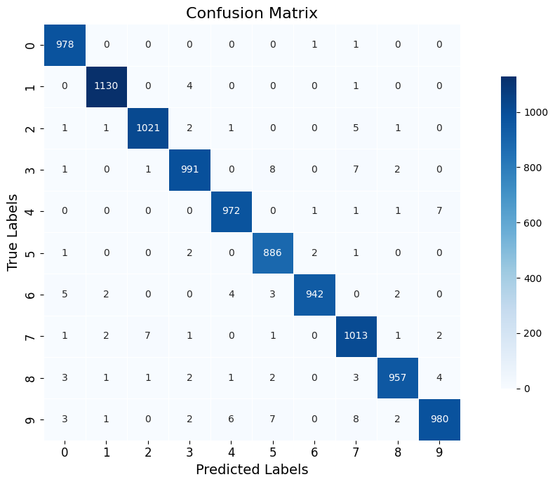

# 🧠 MNIST Handwritten Digit Classification with PyTorch

A clean CNN-based digit classifier built with PyTorch using the MNIST dataset.

## 📦 Features

* Modular CNN using `nn.Sequential`
* Training/validation split: **50,000 train / 10,000 val**
* `tqdm` progress bar for clear epoch tracking
* Evaluation metrics: **accuracy** and **F1-score**
* Confusion matrix visualization using `seaborn`

## 📊 Dataset

The [MNIST dataset](http://yann.lecun.com/exdb/mnist/) contains:

* **60,000 training images**

  * split into **50,000 for training**, **10,000 for validation**
* **10,000 test images**
  Each image is **28×28 grayscale** and represents digits **0–9**.

## 🧰 Requirements

Install dependencies:

```bash
pip install torch torchvision torchmetrics matplotlib seaborn tqdm
```

## 🧠 Model Architecture

```python
class MNISTClassification(nn.Module):
    def __init__(self):
        super().__init__()

        self.conv_block = nn.Sequential(
            nn.Conv2d(1, 10, kernel_size=5),
            nn.ReLU(),
            nn.MaxPool2d(2),
            nn.Conv2d(10, 20, kernel_size=5),
            nn.Dropout2d(),
            nn.ReLU(),
            nn.MaxPool2d(2)
        )

        self.fc_block = nn.Sequential(
            nn.Linear(320, 50),
            nn.ReLU(),
            nn.Dropout(),
            nn.Linear(50, 10)
        )

    def forward(self, x):
        x = self.conv_block(x)
        x = x.view(x.size(0), -1)
        x = self.fc_block(x)
        return F.log_softmax(x, dim=1)
```

## 📊 Results

### 🏋️ Training and Validation Performance

| Epoch | Train Loss | Val Loss | Val F1  | Val Acc |
|-------|------------|----------|---------|---------|
| 1     | 0.6291     | 0.1312   | 0.9585  | 0.9587  |
| 2     | 0.2794     | 0.0946   | 0.9684  | 0.9684  |
| 3     | 0.2288     | 0.0744   | 0.9760  | 0.9760  |
| 4     | 0.2007     | 0.0681   | 0.9780  | 0.9781  |
| 5     | 0.1846     | 0.0656   | 0.9793  | 0.9793  |
| 6     | 0.1729     | 0.0604   | 0.9805  | 0.9805  |
| 7     | 0.1719     | 0.0559   | 0.9827  | 0.9827  |
| 8     | 0.1581     | 0.0546   | 0.9825  | 0.9824  |
| 9     | 0.1531     | 0.0579   | 0.9819  | 0.9821  |
| 10    | 0.1469     | 0.0496   | 0.9851  | 0.9852  |

### 🧪 Final Test Results

- **Test Accuracy:** 98.70%  
- **Test F1 Score:** 98.69%

## 📉 Confusion Matrix

<p align="center">
  
</p>

## 📚 References

* [PyTorch Official Tutorials](https://pytorch.org/tutorials/)
* [MNIST Dataset](http://yann.lecun.com/exdb/mnist/)

